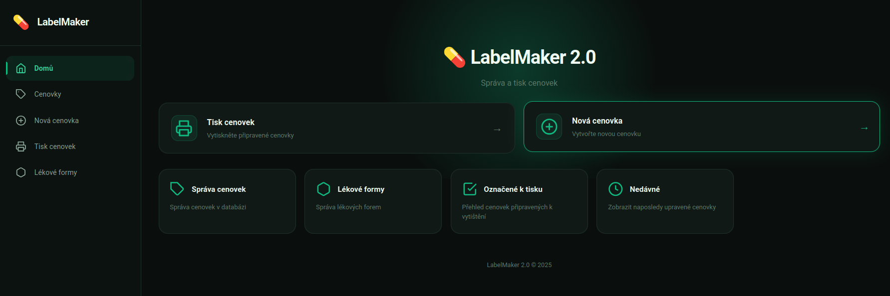
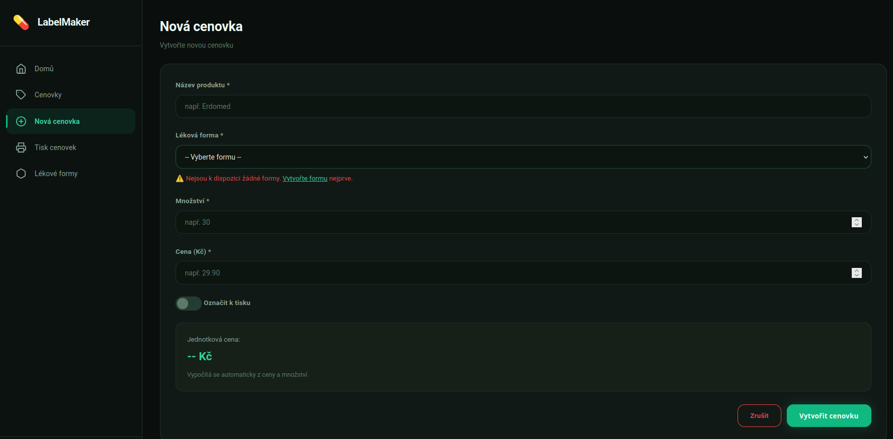
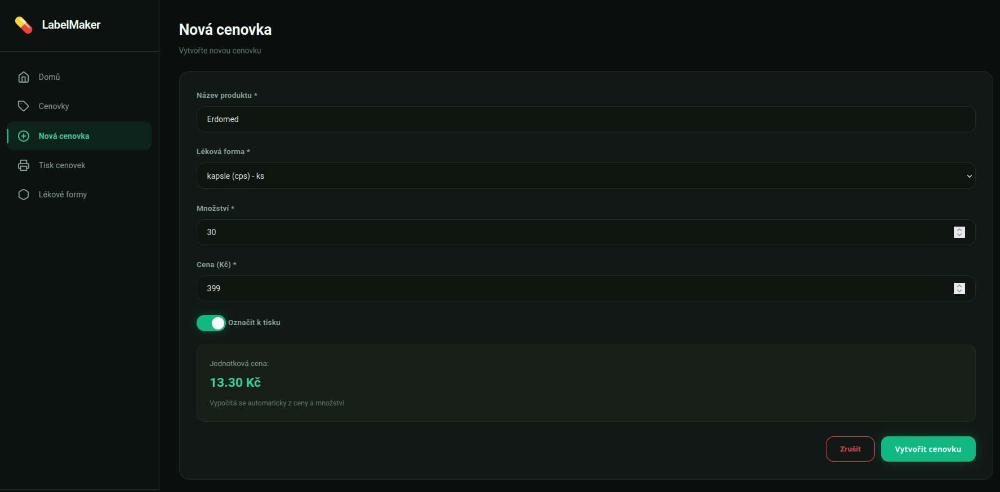
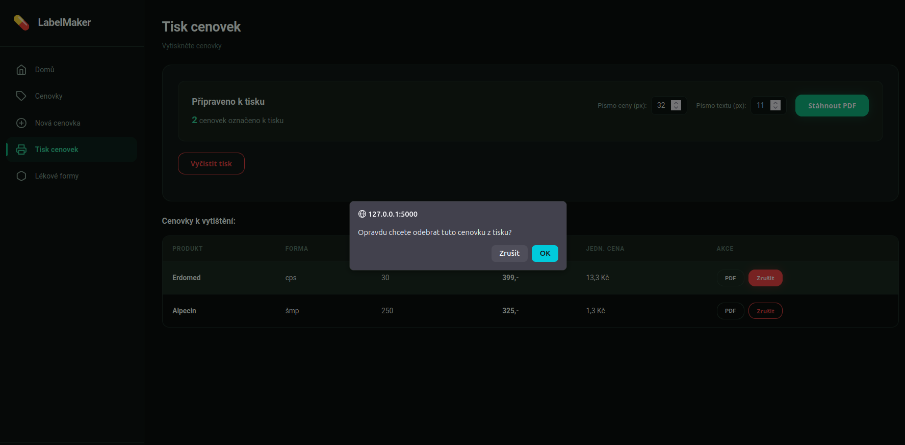

# LabelMaker 2.0

<p align="center">
   
   
   
   
</p>

LabelMaker is a simple, standalone web app for generating price labels, designed for Czech pharmacies. It runs locally, requires no installation, and supports Czech language and PDF export.

## Features
- Create, edit, and delete price labels
- Manage pharmaceutical forms
- Print labels as PDFs (A4, 48×35mm)
- Full Czech character support
- Bulk mark/unmark for printing

## Quick Start
1. Clone the repo:
   ```bash
   git clone <repository-url>
   cd LabelMaker-2.0
   ```
2. Create a virtual environment:
   - Windows:
     ```bash
     python -m venv venv
     venv\Scripts\activate
     ```
   - Linux/Mac:
     ```bash
     python3 -m venv venv
     source venv/bin/activate
     ```
3. Install dependencies:
   ```bash
   pip install -r requirements.txt
   ```
4. Run the app:
   ```bash
   python main.py
   ```
   The app opens at http://127.0.0.1:5000 and stores data in the `instance/` folder.

## Windows EXE
- Build a standalone EXE with `python build_exe.py` (Windows only)
- Output: `dist/LabelMaker.exe` (no Python needed for users)
- Data is persistent in `instance/labelmaker.db` next to the EXE

## Usage
- Add forms and labels via the web UI
- Print selected labels as PDF
- All data is saved locally and persists between runs

## Troubleshooting
- Delete `instance/labelmaker.db` to reset data
- Logs: `instance/logs/labelmaker.log`
- For port/database changes, edit `.env` or `main.py`

## Tech
- Python 3.9+, Flask, SQLite, SQLAlchemy, ReportLab, JavaScript, CSS

## License
MIT

Author: Barbora Hůlová

## 🗂️ Project Files

- `main.py` — Main entry point for running the app.
- `build_exe.py` — Script to build a Windows EXE using PyInstaller.
- `launcher_tray.py` — System tray launcher used by the Windows EXE.
- `launcher.py` — Compatibility entry point that forwards to `launcher_tray.py`.

## 🖨️ Usage

### Adding a pharmaceutical form
1. Click on "Lékové formy" (Forms)
2. Fill in name (e.g., "Tablety"), short name (e.g., "tbl"), and unit (e.g., "ks")
3. Click "Přidat formu" (Add form)

### Creating a label
1. Click on "Nová cenovka" (New label)
2. Fill in:
   - **Product name** - e.g., "Paralen 500mg"
   - **Pharmaceutical form** - select from dropdown
   - **Amount** - e.g., 24 (pieces)
   - **Price** - e.g., 89.50 Kč
3. Check "Označit k tisku" (Mark for printing) if you want to print immediately
4. Click "Přidat cenovku" (Add label)

### Printing labels
1. On the "Cenovky" (Labels) page, check the labels you want to print
2. Click "Tisknout označené" (Print marked)
3. Review the preview and click "Stáhnout PDF" (Download PDF)
4. Print the PDF on colored A4 paper

### Printing tips
- **Paper**: A4 colored paper (48×35mm labels)
- **Orientation**: Portrait
- **Margins**: 0mm (full bleed)
- **Scale**: 100% (no scaling)
- **Layout**: 32 labels (4 columns × 8 rows)

## 🛠️ Technologies

- **Backend**: Flask 3.0+ (Python web framework)
- **Database**: SQLite + SQLAlchemy ORM
- **PDF**: ReportLab with DejaVu Sans fonts
- **Frontend**: Vanilla JavaScript + CSS
- **Templating**: Jinja2


## 📦 Windows EXE Version

For creating a standalone Windows EXE file that users can double-click to run:

### Prerequisites
- Windows machine (or Windows CI runner like GitHub Actions)
- Python 3.9+ installed

### Build Steps

```bash
# 1. Create virtual environment
python -m venv venv
venv\Scripts\activate

# 2. Install dependencies
pip install -r requirements.txt

python build_exe.py
```

**Output:** `dist/LabelMaker.exe` (single file, ~150MB)


### How it works
- **One-file bundle**: All Python code, templates, and static files embedded in the EXE
- **Auto-launch**: Double-clicking opens the app in default browser, starts Flask server
- **System tray**: Icon in Windows system tray to reopen browser or quit app
- **Persistent data**: Database stored in `instance/labelmaker.db` next to the EXE


### Distribution
- Copy `dist/LabelMaker.exe` to users
- No Python installation required on user's PC
- Works on Windows 7+ (with modern OS)

**Note:** First run takes 5-10 seconds (extracting files to temp folder). Subsequent runs are faster.

## 🔧 Configuration

### Environment Variables (`.env` file)

Create a `.env` file in the project root:

```bash
# Debug mode (optional, default=true)
DEBUG=true

# Logging level (optional)
# When DEBUG=true: defaults to DEBUG
# When DEBUG=false: defaults to INFO
LOG_LEVEL=DEBUG  # Options: DEBUG, INFO, WARNING, ERROR

# Database path (optional, defaults to instance/labelmaker.db)
DATABASE_URL=sqlite:///path/to/custom.db

# Flask port (set in main.py instead)
PORT=5000
```

### Log Output
- **Console**: Real-time logs while running (see terminal output)
- **File**: Saved to `instance/logs/labelmaker.log` (rotating, max 2MB)

**Log levels:**
- `DEBUG` - Detailed info, SQL queries, form lookups (development)
- `INFO` - Application flow, user actions (default)
- `WARNING` - Potential issues
- `ERROR` - Errors that occurred

### Changing Port

Edit `main.py`, find this line:
```python
app.run(host="127.0.0.1", port=5000, debug=False)
```

Change `5000` to your desired port (e.g., `8080`).

## 🐛 Troubleshooting

### Port already in use
```bash
# Windows
netstat -ano | findstr :5000
taskkill /PID <PID> /F

# Linux/Mac
lsof -ti:5000 | xargs kill -9
```

### Database errors
```bash
# Delete database and start fresh
rm -rf instance/labelmaker.db
python main.py
```

### No DEBUG messages visible
- Check `.env` has `DEBUG=true`
- Restart the app after changing `.env`
- Logs are in `instance/logs/labelmaker.log`

### Foreign key constraint errors
- Delete database and recreate: `rm -rf instance/labelmaker.db`
- Ensure you create pharmaceutical forms before labels

### Form lookup shows "ks" instead of actual unit
- Delete database (schema changed): `rm -rf instance/labelmaker.db`
- Recreate forms and labels

### Czech characters not displaying in PDF
- The application uses DejaVu Sans fonts with full Czech support
- If missing, reinstall: `pip install reportlab --upgrade`

### Application won't start
```bash
# Check Python version (must be 3.9+)
python --version

# Reinstall dependencies
pip install -r requirements.txt --force-reinstall
```

### EXE build fails
- Ensure you're on Windows (or use GitHub Actions to build)
- Delete `build/` and `dist/` folders and try again
- Check that all dependencies are installed: `pip install -r requirements.txt`


## 📝 Database Schema

### Table: `label` (Price Labels)
- `id` - Primary key (auto-increment)
- `product_name` - Product name
- `form` - Pharmaceutical form (foreign key)
- `amount` - Amount/quantity
- `price` - Price
- `unit_price` - Price per unit (auto-calculated)
- `marked_to_print` - Marked for printing (boolean)
- `created_at` - Creation date

### Table: `form` (Pharmaceutical Forms)
- `name` - Form name (primary key)
- `short_name` - Abbreviation (unique)
- `unit` - Unit (ks, ml, g, ...)


## 🤝 Contributing

1. Fork the project
2. Create your feature branch (`git checkout -b feature/new-feature`)
3. Commit your changes (`git commit -m 'Add new feature'`)
4. Push to the branch (`git push origin feature/new-feature`)
5. Open a Pull Request


## 📄 License

MIT


## 👨‍💻 Author

Barbora Hůlová

---

**Version**: 2.0  
**Date**: March 2026  
